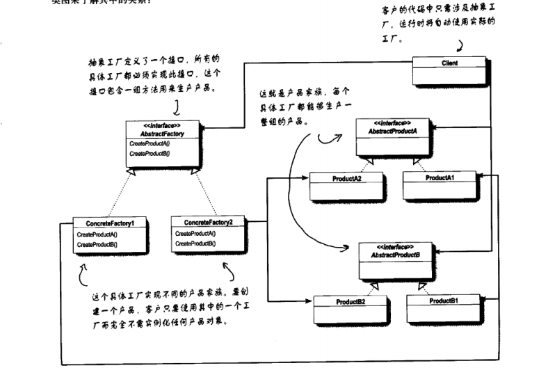

# 抽象工厂
## 定义
**抽象工厂模式**提供一个接口，用于创建相关或依赖对象的家族，而不需要明确指定具体类

抽象工厂允许客户使用抽象的接口来创建一组相关的产品，而不需要知道（或关心）实际产出的具体产品是什么。
这样一来，客户就从具体的产品中被解耦

## 源码案例剖析
## 思考
 1. 工厂方法是不是潜伏在工厂里面？
 
    抽象工厂的方法经常以工厂方法的方式实现。抽象工厂的任务是定义负责创建一组产品的的接口。
    这个接口内的每个方法都负责创建一个具体产品，同时我们利用实现抽象工厂的子类来提供这些
    具体的的做法。所以，在抽象工厂中利用工厂方法实现生产方法是相当自然的做法。
  ## 工厂方法与抽象工厂的区别
   1. 都是工厂模式，都通过减少应用程序和具体类之间的依赖促进松耦合
   2. 利用工厂方法创建对象，需要继承拓展一个类，并覆盖工厂方法。而抽象工厂则是通过对象的
    组合，把一群相关的产品组合起来
   3. 抽象工厂提供一个用来创建产品家族的抽象类型，这类型的子类定义了产品被生产的方法。要使用这个
    工厂必须先实例化它，然后将它传入到针对抽象类型所写的代码中。
   4.抽象工厂模式中，如果加入新产品就必须改变抽象工厂接口，这是很麻烦的事情。所以该接口必须是一个
   很大的接口，因为它需要创建整个产品家族类型
   
## 应用场景
 - 抽象工厂：需要创建产品家族和想让制造的产品集合起来时
 - 目前不知道将来需要实例化哪些类时