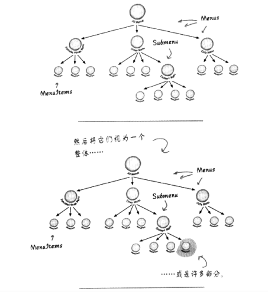

# 组合模式
## 定义
**组合模式**允许你将对象组组合成树形结构来表现“整体/部分”层次结构，组合能让客户已一致的方式处理个别对象以及对象组合

组合模式让我们能用树形方式创建对象的结构，树里面包含了组合以及个别对象。使用组合结构，我们能把相同的操作应用在组合和个别对象
上。换句话说，在大多数情况下我们可以忽略对象组合和个别对象之间的差异。

以菜单为例：这个模式能够创建一个树形结构，在同一个结构中处理嵌套菜单和菜单项组。通过菜单和菜单项组成的对象树。但是可以将它视为一个整体，像是一个丰富的大菜单

组合模式以单一责任设计原则换取透明性。什么是透明性？通过让组件的接口同时包含一些管理子节点和叶节点的操作，客户就可以将组合和叶节点一视同仁，也就是说，一个元素究竟是组合还是叶节点，对客户是透明的。

示例项目中，在 MenuComponent 类中同时具有两种类型的操作。因为客户有机会对一个元素做一些不恰当或是没有意义的操作(例如试图把菜单项添加到菜单项)，我们失去了一些安全性。
这是设计上的抉择；我们当然也可以采取另一种方向上的设计，将责任区分开来放在不同的接口中。这么一来，设计上就比较安全，但我们也因此失去了透明性，客户的代码必须用条件语句和
instanceof操作符处理不同类别的节点

示例项目是一个很典型的折衷案例。尽管我们受到设计原则的指导，但是，我们总是需要观察某原则对我们的设计所造成的影响。有时候，我们会故意做一些看似违反原则的事情。然而，
在某些例子中，这是观点的问题；比方说，让管理孩子的操作（例如add(),remove(),getChild()）出现在叶节点中，似乎很不恰当，但是换个角度来看，你可以把叶节点
视为没有孩子的节点。

## 要点
 - 组合模式提供一个结构，可同时包含包容个别对象和组合对象
 - 组合模式允许客户对个别对象和组合对象一视同仁
 - 组合结构内的任意对象称为组件，组件可以是组合，也可以是叶节点。
 - 在实现组合模式时，有许多设计上的折衷，你要根据需要平衡透明性和安全性。
 