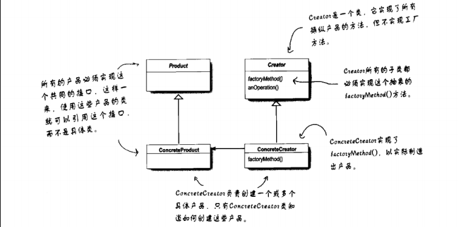
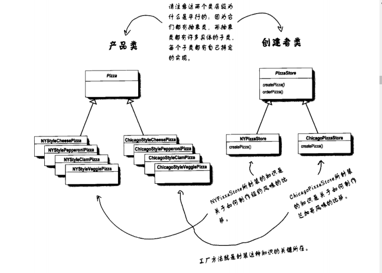

# 工厂方法模式
## 定义
**工厂方法模式**定义了一个创建对象的接口，但由子类决定要实例化的类是哪一个，工厂方法让类把实例化推迟到子类

所有工厂方法都用来封装对象的创建，工厂方法模式(Factory Method Pattern) 通过让子类决定该创建的对象是什么。如下类图，抽象的Creator提供了
一个创建对象对象的方法的接口，也称为“工厂方法”，在抽象的 Creator 中,任何其他实现的方法，都可能用到这个工厂方法所制造出来的产品，但只有子类
ConcreteCreator）真正实现这个工厂方法并创造产品。

如同在定义中所说的，常常听到开发人员说：工厂方法让子类决定要实例化的类是哪一个。希望不要理解错误，所谓的”决定”并不是指模式允许子类本身在运行
时做决定。而是指在编写创建者类时，不需要知道实际创建的产品是哪一个。选择了使用那个子类，自然就决定了实际创建的产品是什么。

## 源码案例解释
  源码中以模拟下单购买Pizza的场景，只要实体是比萨店（PizzaStore）与比萨(Pizza)。
 
## 思考
  1. 源码中，每个商店基于传入的类型制造出不同种类的比萨,这种方式称为参数化工厂方法。
  案例使用字符串作为参数化的类型，这种方式很危险，万一字符串拼写错误会造成所谓的“运行时异常”。
  
  可以使用一些复杂的技巧避开这个麻烦，在编译时期就将参数上的错误挑出来。比方说，可以创建
  代表参数类型的对象和使用静态常量或者枚举类型enum
  
  2. 工厂方法与简单工厂的区别
  简单工厂把创建对象的事情在一个地方处理完了，然而工厂方法是创建一个框架，让子类决定要如何实现。
  简单工厂将对象的创建封装起来，但是简单工厂不具备工厂方法的弹性，因为简单工厂不能变更正在创建的产品。
  