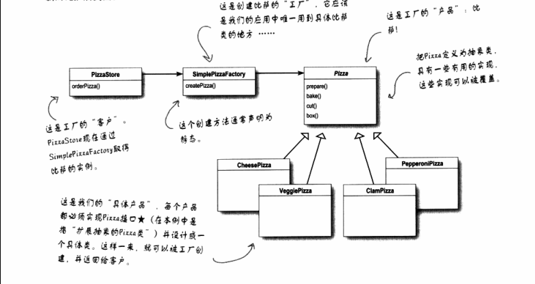

# 简单工厂模式
## 理解定义
简单工厂其实不是一个设计模式，反而比较像一种编程习惯。我们通常将创建对象的细节封装起来放在一个新的类中。
这个新类习惯被称为工厂。
## 案例剖析
本案例中，比萨店（PizzaStore）将创建披萨（Pizza）的细节交给 SimplePizzaFactory,orderPizza（）变成工厂对象的客户。
当需要比萨时，就叫比萨工厂做一个，orderPizza()只关心从比萨工厂得到一个比萨，而不关心创建的细节了。

 ## 理解静态工厂
 利用静态方法定义一个简单得工厂，这是很常见得技巧，常被称为静态工厂。为何使用静态工厂方法？因为不需要使用创建对象的方法来实例化对象。
 使用静态工厂方法的缺点是不能通过继承来改变创建方法的行为。